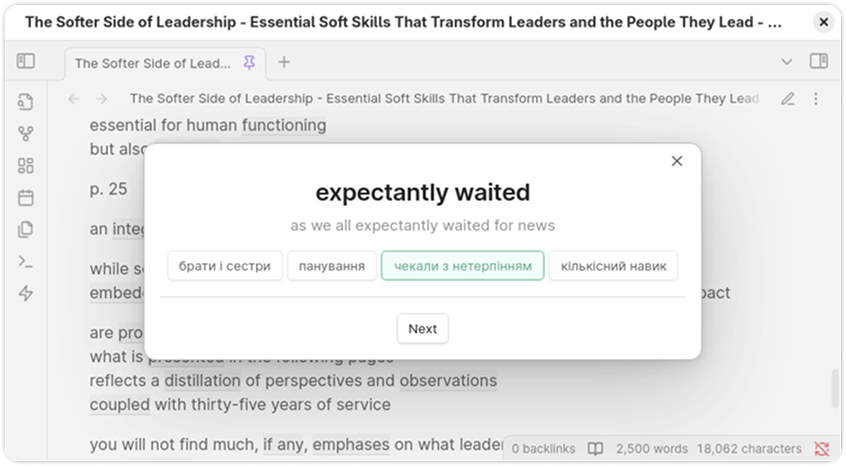
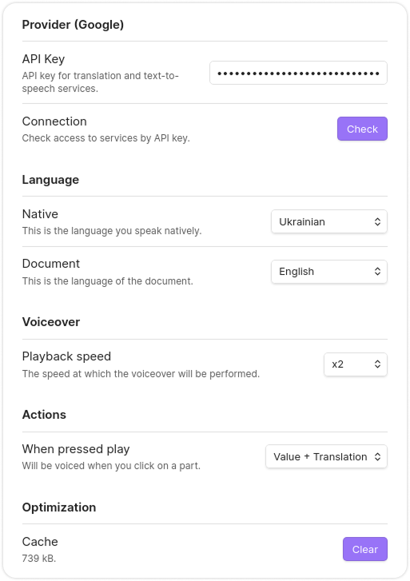

# Obsidian Memoduck Plugin

### Description

We all know paid services like [Quizlet](https://quizlet.com/), [Readlang](https://readlang.com/), or free ones like [Anki](https://apps.ankiweb.net/). Memoduck offers something similar, but much simpler and focused exclusively on memorizing language parts. Study whenever it suits you, without any limitations, on **mobile** or **desktop**.

### Installation

1. Launch Obsidian.
2. Navigate to `Settings` > `Community Plugins`.
3. Search for `Memoduck`.
4. Install and enable the plugin.

### Settings

The plugin uses an API for text translation and text-to-speech (TTS). Currently, the provider is Google. To obtain an API key, you need to enable access to two services: [Cloud Translation API](https://console.cloud.google.com/marketplace/product/google/translate.googleapis.com) and [Cloud Text-to-Speech API](https://console.cloud.google.com/marketplace/product/google/texttospeech.googleapis.com). After that, you can create an API key in the [Credentials](https://console.cloud.google.com/apis/credentials) section.

### Syntax

The plugin has its own syntax. In the documentation, we will use the word «part» or «parts» to refer to a word or phrase (or words and phrases).

`{value|translation}`

On the left, there can be a value, and on the right, the translation. If there is more than one translation, they can be listed separated by commas.

`{some value|translation, translation, translation, ...}`

All translations will be considered as one.

In reading mode, the translation will be hidden, and the part will be highlighted with specific styles.

### Hotkeys

In the settings hotkeys, find the command `Memoduck: Translate` and set a hotkey, for example, `Alt+T`.

For a quick translation and to convert a part to plugin syntax, select what you need and press `Alt+T`. After translation, text-to-speech (TTS) will be called for the value and its translation.

`car` -> `{car|автомобіль}`

### Practice

For practice, open a document in reading mode and click the flash icon in the left ribbon menu, or search for `Memoduck` in the command palette.

If you don't want to practice all the parts in the document, just select what you need. If a part is not fully highlighted, it will still be selected.

### Cache

After text-to-speech (TTS), the result will be saved to the cache at the path below and will be used for the next audio playback.

`.obsidian/plugins/memoduck/cache`
